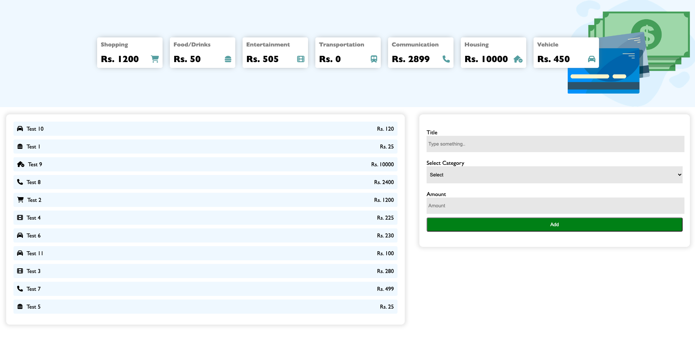

# Expense Tracker

Project built with HTML5, CSS3, Javascript and Firebase.

A simple project to demonstrate usage of firebase' firestore database using Javascript. It's a mini project which allows user to track his expenses.

# Installation

It's a easy to go project. Simply create a project in Firebase. You can follow below link for the same.

[Getting started with Firebase](https://firebase.google.com/docs/firestore/quickstart?hl=en)

Next goto your firebase' project settings to get the configurations/keys. Copy them and paste them in init-firebase.js file given in the project.

# Screenshot

